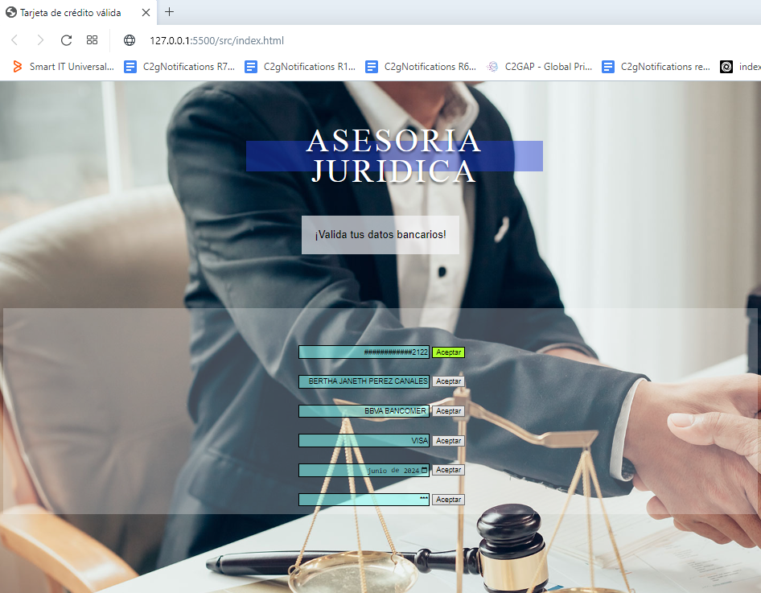
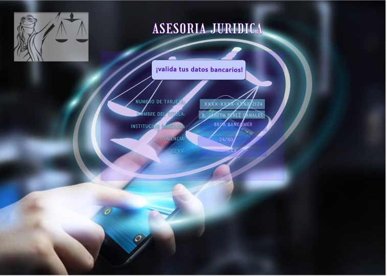

# CARD VALIDATION

El presente proyecto data respecto a serie de declaraciones realizadas empleando js. en tipo "module", a fin de poder implementar la funcionavilidad del algoritmo de Luhn, con la finalidad princiapal de que el usuario de una pagina de asesoria legal en linea pueda realizar el pago de los servicios requeridos, llevando a cabo la validacion de una tarjeta bancaria.  

## _Pagina_




### _1.Usuarios y Objetivos_

En la actualidad, y debido a las diversas contingencias sanitarias que aquejan al mundo, nos han llevado a modificar diversos aspectos de nuestra vida cotidiada a fin de ser mas amenos con la tecnologia.

Tal es el caso del mundo juridico, puesto que con las medidas sanitarias se ha optado por el asesoramiento via medios remotos, pero poco se habla de los atrasos en cuanto a recursos tec. para eficientizar la atencion final del usuario.

Viendo la dificultades y fraudes que presentan los usuarios, la pagina fue creada con el objetivo final de que estos, pudieran contratar de manera segura los servicios de un abogado, pensando en lo anterior, se crean diversas funciones con la finalidad de poder implementar ``` "el Algoritmo de Luhn" ```, con el cual se realiza la validacion de la tarjeta, al igual que una funcion a fin de poder enmascarar los digitos de su tarjeta, con excepcion de los ultimos 4. 

Pensando en una interfaz agradable con el usuario, en la misma pag podra visualizarse si dicha tarjeta es valida y no, ya que al presionar el boton "Aceptar" este cambiara a un color _verde_ para el caso en que sea valida, y un color _rojo_ en el caso de ser invalida, para el caso en que se ingresen un mayor o menor numero al permitido, se visualizara una alerta en la parte superior de la paguina indicandole al usuario que no podra ingresar mayor o menor numero de digitos, segun sea el caso. simultaneamente con el cambio de color para el caso al que corresponda, los valores ingresados de cubriran y seran remplazados por _#_. con excepcion de los ultimos 4 digitos, esto con la finalidad de proteguer los datos del usuario. 

## _FEEDBACK_

*Desde el dia uno se detecta areas de oportunidad con respecto a temas de diseño, ya que en diversos feedback recibidos tanto por compañeras como por couchs, fueron comentarios respectos a diseño a fin de que fuera mas agradable al usuario. En vista a lo anterior se implementan las observaciones las que ban desde un fondo con colores mas suabes para el usuario, al cambio de color del fondo de los inputs.*



